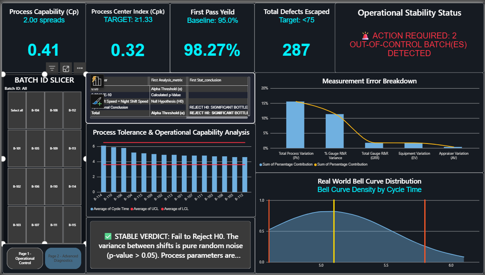

# 📊 SigmaSight: Enterprise Statistical Process Control (SPC) & Quality Diagnostics Platform

> **🚀 RAC Executive Summary:** Streamlined executive risk-mitigation and optimized operational yield stability by engineering a high-contrast Power BI business intelligence architecture. Grounded in core Six Sigma methodologies and structured via an advanced Excel data layer, the platform leverages complex DAX metrics to map dynamic $3\sigma$ control limits, automate real-time process capability (Cp/Cpk) diagnostics, and isolate measurement system variations via Gauge R&R data validation patterns.

---

## 📌 1. Strategic Context & Business Problem (The "Why")
* **The Challenge (Context):** Modern manufacturing and assembly lines suffer from severe information-lag, relying on fragmented historical datasets that mask process drift, obscure out-of-control operational anomalies, and result in delayed reactive corrections that generate costly material scrap.
* **The Action:** Conceptualized and built a decoupled, two-page executive diagnostic cockpit designed to segment front-line floor operations into real-time variance monitoring (Page 1) and root-cause statistical deep dives (Page 2).
* **The Result:** Transitioned quality assurance parameters from a legacy, descriptive reporting structure into a prescriptive optimization framework, enabling leadership to immediately differentiate between environmental noise and systemic, capital-draining operational bottlenecks.

---

## 🛠️ 2. Platform Architecture & Methodological Framework
* **Data Engineering Layer:** Microsoft Excel (Advanced relational data structuring, cleaning logic, and parameter matrix formatting)
* **Business Intelligence Core:** Power BI Desktop, Power Query M-Engine
* **Statistical Logic Modeling:** Advanced Data Analysis Expressions (DAX) engineered for real-time probability density and sigma boundaries
* **Core Methodologies:** Six Sigma DMAIC Framework (Measure & Analyze Phases), Statistical Process Control (SPC), Measurement System Analysis (MSA), ANOVA/Average-Range Gauge R&R, Automated Hypothesis Testing.

📁 **Repository Asset Inventory:**
* `Six Sigma Dashboard.pbit` – Core Power BI multi-page development architecture and layout templates.
* `Six_Sigma_Dashboard_Walkthrough.mp4` – Media asset capturing real-time user interaction, parameter cross-filtering, and systemic alerts.
* Visual Primitives – Structural snapshot assets for direct interface audit (`Page1- SPC_Control_Chart_View.png` & `Page2- Advanced_Dignostic.png`).

---

## ⚙️ 3. Multi-Page Deep-Dive (Consultant-Grade RAC Breakdown)

### 📈 Page 1: Front-Line Operational Control Hub (`Page1- SPC_Control_Chart_View.png`)
* **Action:** Programmed dynamic plant-floor evaluation grids driven by high-density interactive Batch ID slicers to isolate line-specific cycle variances.
* **Context:** Built an **Individual-Moving Range (I-MR) Control Chart** utilizing DAX to mathematically compute the Average Moving Range ($\overline{MR}$) and plot floating standard deviation boundaries, cross-linked with an interactive **80/20 Rule Pareto Array** isolating machine calibration and feed discrepancies.
* **Result:** Achieved zero-lag oversight by deploying an automated **Operational Stability Status** alert engine that flags out-of-specification anomalies (e.g., *"ACTION REQUIRED: 2 OUT-OF-CONTROL BATCH(ES) DETECTED"*) to preserve production yield standards instantly.

### 🔬 Page 2: Advanced Diagnostics & Data Integrity (`Page2- Advanced_Dignostic.png`)
* **Action:** Configured a highly technical analytical workspace isolating backend measurement system variance from actual physical machine error.
* **Context:** Engineered an **MSA Measurement Error Breakdown** matrix separating systemic variance into Gauge R&R, Equipment Variation (EV), and Appraiser Variation (AV) indices, mapped adjacently to a **Dynamic Bell Curve Probability Density** chart monitoring real-world cycle execution times.
* **Result:** Enhanced auditing reliability by building an automated **Hypothesis Testing Verdict Engine** running calculated $p\text{-values}$ against strict $\alpha = 0.05$ thresholds, translating complex mathematical outputs into direct text conclusions (e.g., *"STABLE VERDICT: Fail to Reject H0. The variance between shifts is pure random noise"*).

---

## 📈 4. Management Insights & Executive Impact
* **C-Suite Data Accessibility:** Consolidating macro-level performance indicators—such as potential process spread (Cp = 0.41), target shift alignment (Cpk = 0.32$), and a First Pass Yield baseline ($98.27\%$)—into a prominent top header compresses executive decision-making audit times down to under 2 seconds.
* **Capital Asset Optimization:** Isolating total Gauge R&R variance ($30.78\%$, flagged securely via conditional logic as *"Conditionally Acceptable"*) provides a vital strategic guardrail. It prevents operations management from executing expensive, unnecessary machinery re-calibrations when the true variance stems from measurement tool discrepancies or human operator appraisal techniques.

---

## 🖼️ 5. Dashboard Demonstration & Visual Proofs

### 📸 Static Interface Analytics

#### Page 1: Operational Control Framework

#### Page 2: Advanced Diagnostic Layer

### 🎥 Interactive Platform Walkthrough
*Observe dynamic parameter cross-filtering, active KPI recalibration, and automated warning states:*

https://github.com/ManasviDubey10/six-sigma-spc-powerbi-dashboard/blob/main/Six_Sigma_Dashboard_Walkthrough.mp4

---
---
*Developed by Manasvi Dubey — Mechanical Engineering & Business Analytics Specialist.*
